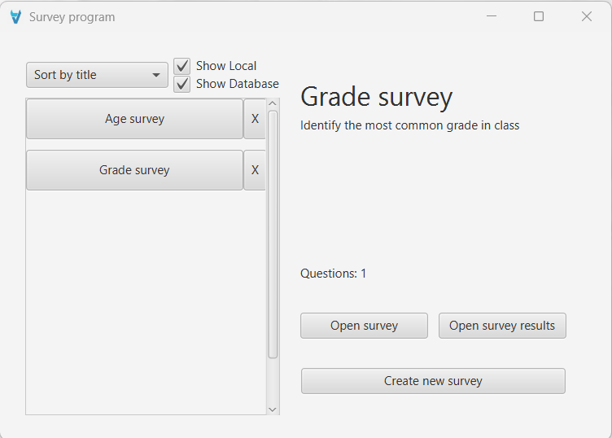
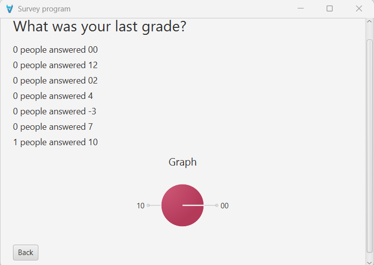

# Survey program - first semester

Create and answer surveys

## Features:
- Create and answer survey
- Save responses using either:
  - Local storage by storing serialized objects in a `.ser` file
  - SQL database
- Run using either a GUI or commandline (commandline is not fully functional)
- View data in a pie chart

## How to run:
** GUI **
- Run the program normally (Using the Main.java)

**Commandline**
- Run the `UICommandLineStart.java`
  - Directory: `src/main/java/com/example/sp4/UI/CommandLine/UICommandLineStart.java`
- OR type `Main.java -cmd` (only if you have Java in your path variable)

## Class diagram

## GUI Sketches
**Made before coding the GUI**

### Survey selection/start screen

### Survey creation screen

### Survey answer screen

